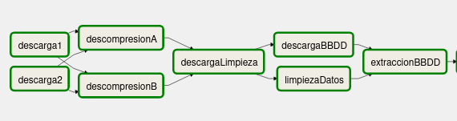
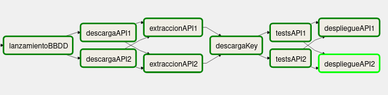

# CC_P2_airflow
Práctica 2 de la asignatura Cloud Computing: Servicios y Aplicaciones.
Máster en Ingeniería Informática de la Universidad de Granada.

La práctica aborda la construcción de un servicio de predicción de humedad y temperatura de la ciudad de San Francisco (Estados Unidos). Para ello, se ha utilizado la plataforma AirFlow, creando un Grafo Acíclico Dirigido (DAG) que ejecuta todas las tareas necesarias para la implementación. 

<!-- aquí va el dag -->

Las tareas incluidas son las siguientes:

- **DatosA y DatosB:** se descargan [humidity.zip]() y [temperature.zip](), que contienen datos sobre la temperatura y humedad de distintas ciudades a lo largo de un período de tiempo. 
- **DescompresionA y DescompresionB:** se descomprimen las carpetas en el directorio `/tmp`.
- **DescargaLimpieza y LimpiezaDatos:** se descarga [limpieza_datos.py]() y se utiliza sobre los datos descargados. De este modo, se cogen solo los registros referentes a San Francisco y se fusionan en un único fichero `data.csv`. Además, solo se han tomado 40 filas para agilizar las predicciones posteriores.
- **DescargaBBDD y ExtraccionBBDD:** se descarga y extrae la carpeta [database.zip](https://github.com/aure-nogueras/CC_P2_airflow/blob/main/database.zip), que contiene un fichero `docker-compose.yml` y sus correspondientes variables de entorno, almacenadas en `.env`.
- **LanzamientoBBDD:** se lanza el `docker-compose` y se inyectan los datos contenidos en `data.csv`.
- **DescargaAPI1 y DescargaAPI2:** se descargan las carpetas [carpeta_v1.zip](https://github.com/aure-nogueras/CC_P2_airflow/blob/main/carpeta_v1.zip) y [carpeta_v2.zip](https://github.com/aure-nogueras/CC_P2_airflow/blob/main/carpeta_v2.zip). 
- **ExtraccionAPI1 y ExtraccionAPI2:** se descomprimen las carpetas. Cada una de ellas contiene una versión distinta que se usará para realizar la predicción. La versión 1 utiliza el algoritmo ARIMA, mientras que la versión 2 usa una API llamada *Visual Crossing Weather*. Los datos contenidos en `data.csv` son utilizados por la versión 1, mientras que la versión 2, al utilizar una API externa, usa los datos proporcionados por esta.
- **DescargaKey:** se descarga la API key para utilizar *Visual Crossing Weather*. Esta clave se ha almacenado en Google Drive para que no esté disponible de forma pública.
- **TestsAPI1 y TestsAPI2:** se ejecutan algunos tests de unidad sobre ambas versiones, para comprobar su correcto funcionamiento. En el caso de que no se superaran los tests, se pararía el flujo de trabajo.
- **DespliegueAPI1 y DespliegueAPI2:** como paso final, se utiliza `docker` para desplegar dos contenedores, uno para cada una de las versiones. Así, puede consultarse la predicción de las próximas 24, 48 y 72 horas según cada uno de los algoritmos utilizados. Dado que la versión 1 usa datos almacenados, la predicción se hará con respecto a dichos datos, que no se corresponden con la actualidad. Sin embargo, la versión 2 sí devolverá una predicción referente a los próximos días a partir del momento en el que se consulte la API.

El flujo de trabajo resultante queda tal y como muestran las siguientes imágenes:

